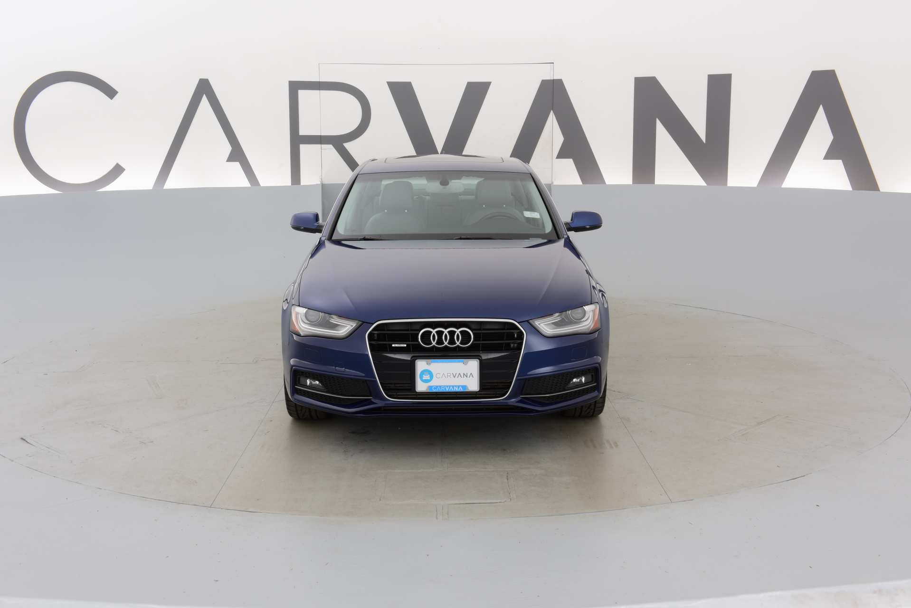

# PytorchCarvanaU-net
The purpose of this project is to gain additional experience using U-nets for image segmentation problems. The structure of this U-net is copied from the winner of a Kaggle competition using U-nets to do image segmentation for a carvana competition. The initial file structure is based on the video "PyTorch Image Segmentation Tutorial with U-NET: everything from scratch baby" by Aladdin Persson. 

The video and dataset can be found through the links below at the time of writing
[U-net Tutorial](https://www.youtube.com/watch?v=IHq1t7NxS8k&t=826s&ab_channel=AladdinPersson)
[Carvana Image Masking Challenge](https://www.kaggle.com/c/carvana-image-masking-challenge)

The aim of the carvana competition was to remove the background from car images so that the car could be displayed in front of any background. To do this there is both the raw .jpg images of the car with the background and mask.gif files showing what areas are car and what areas are background. Example images are shown below

# Usage
In order to use the following 
